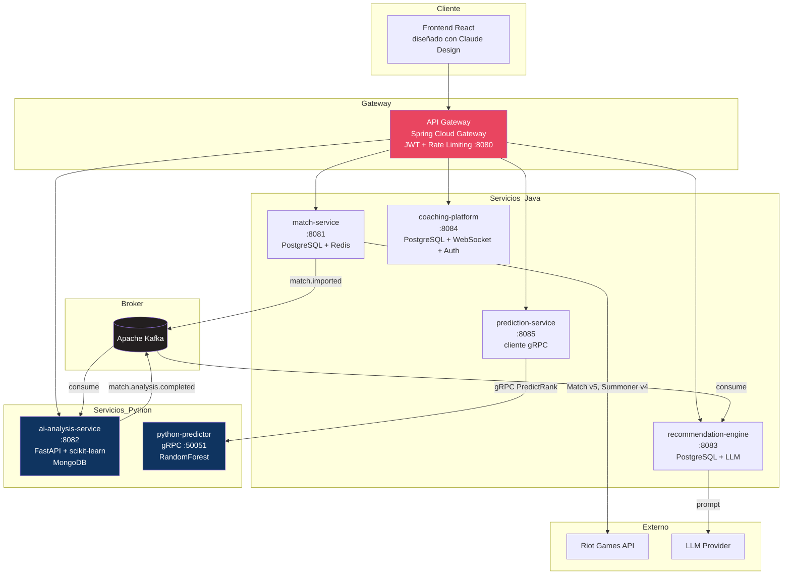

# ValorantHub

Plataforma de análisis de rendimiento, coaching y predicción de rango para jugadores de VALORANT. Arquitectura de microservicios poliglota (Java/Spring Boot + Python/FastAPI) con pipeline de Machine Learning, integración LLM, comunicación event-driven y frontend React diseñado con Claude Design.

> Proyecto de portfolio de mayor envergadura, construido tras validar la metodología de trabajo por fases en [order-system](../order-system). Aquí se escala esa misma metodología a un sistema de 6 microservicios con ML, gRPC, WebSocket y CI/CD completo.

## Stack tecnológico

| Capa | Tecnología |
|---|---|
| Backend core | Java 21, Spring Boot 3.x (Web, Data JPA, Security, WebSocket, Cache) |
| ML / Análisis | Python 3.11, FastAPI, scikit-learn, pandas |
| Comunicación async | Apache Kafka 3.7 |
| Comunicación sync interna | gRPC (prediction-service) |
| Gateway | Spring Cloud Gateway + JWT + Rate Limiting (Redis) |
| Persistencia | PostgreSQL 16 (transaccional), MongoDB 7 (resultados de análisis), Redis 7 (cache/pub-sub) |
| Frontend | React 19 + TypeScript + Vite + Tailwind CSS v4 + TanStack Query |
| Diseño UI | Claude Design (wireframes y sistema de diseño, antes de escribir código de UI) |
| IA generativa | Claude Code (desarrollo asistido), LLM para motor de recomendaciones |
| Observabilidad | OpenTelemetry, Jaeger, Loki + Promtail, Grafana |
| CI/CD | GitHub Actions (lint, test, build, security scan, deploy) |
| Despliegue | VPS (Hetzner o equivalente) + Docker + Nginx + Let's Encrypt |

## Arquitectura



## Servicios

| Servicio | Responsabilidad | Lenguaje |
|---|---|---|
| `match-service` | Importa y persiste partidas desde Riot API, expone histórico y stats agregadas | Java |
| `ai-analysis-service` | Analiza partidas: heatmap de posicionamiento, economía, timing de habilidades, K/D | Python (FastAPI) |
| `recommendation-engine` | Genera recomendaciones personalizadas vía LLM a partir del análisis | Java |
| `coaching-platform` | Auth (JWT), matchmaking de coaches, sesiones, chat en tiempo real (WebSocket) | Java |
| `prediction-service` | Predice rango del jugador; orquesta llamada gRPC al modelo Python | Java + Python |
| `api-gateway` | Punto de entrada único, JWT, CORS centralizado, rate limiting | Java |

## Flujo de negocio principal

1. El usuario importa sus partidas (`match-service` ↔ Riot API), con caché Redis para reducir llamadas.
2. `match-service` publica `match.imported` en Kafka.
3. `ai-analysis-service` consume el evento, ejecuta los analizadores (posicionamiento, economía, timing, K/D) y persiste resultados en MongoDB, publicando `match.analysis.completed`.
4. `recommendation-engine` consume ese evento, construye un prompt con el análisis y genera recomendaciones vía LLM.
5. `prediction-service` expone bajo demanda una predicción de rango, delegando la inferencia a `python-predictor` vía gRPC.
6. `coaching-platform` opera en paralelo: matchmaking de coaches, sesiones y chat WebSocket, sin depender del pipeline de análisis.

## Sistema de diseño (Claude Design)

Antes de escribir una sola línea de frontend, las pantallas se diseñan como wireframes/mockups con la función de diseño de Claude, pantalla a pantalla, iterando sobre un sistema de diseño común:

- **Paleta**: primary `#E94560`, background `#1A1A2E`, accent `#0F3460`, texto `#FFFFFF`
- **Tipografía**: Inter/DM Sans para UI, monoespaciada para estadísticas
- **Componentes base**: stat-card, match-card, tip-card, coach-card, badge-item, nav-bar
- **Pantallas**: Login/Register, Dashboard, Análisis de partida, Recomendaciones, Coaching (listado + chat), Perfil de jugador, Predicción de rango, Gamificación/Badges

Los wireframes aprobados se guardan como referencia en `design/wireframes/` y sirven de especificación visual para los prompts de Claude Code al implementar cada página en React. Ver `docs/GUIA-IMPLEMENTACION.md` → Fase 0.

## Estructura del repositorio

```
valoranthub/
├── CLAUDE.md                    ← contexto global para Claude Code
├── docker-compose.yml           ← infra: postgres/redis/kafka/zookeeper/mongo
├── .env.example
├── Makefile                     ← up/down/logs/rebuild-<servicio>/clean/build/test
├── match-service/                ← Java + CLAUDE.md local
├── ai-analysis-service/          ← Java (+ python-ml/ desde Fase 3) + CLAUDE.md local
├── recommendation-engine/        ← Java + CLAUDE.md local
├── coaching-platform/            ← Java + CLAUDE.md local
├── prediction-service/           ← Java (gRPC client) + CLAUDE.md local
│   └── python-predictor/         ← servidor gRPC Python (Fase 6)
├── api-gateway/                  ← Spring Cloud Gateway (Fase 7) + CLAUDE.md local
├── frontend/                     ← React + TypeScript + Vite
├── design/
│   └── wireframes/               ← mockups generados con Claude Design
└── docs/
    ├── GUIA-IMPLEMENTACION.md
    ├── DEPLOYMENT.md
    └── load-testing/
```

## Roadmap (6 meses / 12 sprints)

| Mes | Sprints | Foco |
|---|---|---|
| 1 | S1–S2 | Infraestructura, Claude Code, `match-service` + Riot API |
| 2 | S3–S4 | `ai-analysis-service` (ML), pipeline Kafka, MongoDB |
| 3 | S5–S6 | `recommendation-engine` (LLM), testing E2E |
| 4 | S7–S8 | `coaching-platform` (auth + WebSocket), `prediction-service` (gRPC) |
| 5 | S9–S10 | `api-gateway`, frontend React (desde wireframes de Claude Design), carga + CI/CD |
| 6 | S11–S12 | Gamificación, observabilidad, despliegue en producción + portfolio |

Detalle completo por sprint en `docs/GUIA-IMPLEMENTACION.md`.

## Cómo ejecutar en local

```bash
git clone https://github.com/AnxnimusDev/valorant-hub.git
cd valorant-hub
cp .env.example .env   # rellena RIOT_API_KEY, ANTHROPIC_API_KEY, etc.
make up                 # infra: postgres/redis/kafka/zookeeper/mongo
make test                # ./mvnw test en los 6 microservicios
```

Cada microservicio se ejecuta suelto con `./mvnw spring-boot:run` dentro de su carpeta (o `make rebuild-<servicio>` para construir su imagen Docker). Se van incorporando a `docker-compose.yml` servicio a servicio a medida que cada fase los deja funcionales — ver `docs/GUIA-IMPLEMENTACION.md`.

## Licencia

MIT
